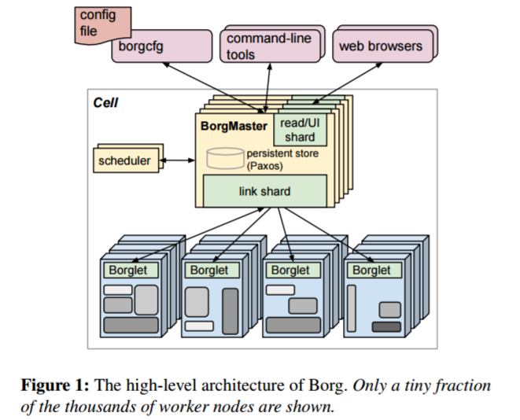
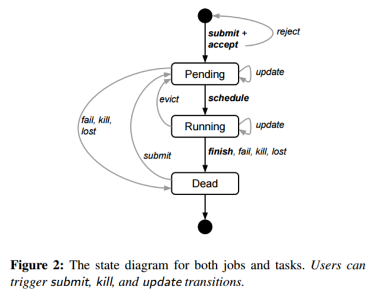

# Google Borg
## 简介
Borg是Google的集群管理系统，管理着多个由成千上万台机器组成集群，上面运行着10万+的任务和上千种不同类型的应用。

它组合了诸如提交控制，高效的任务包装，过量提交，进程级性能隔离的机器共享等这些方法来获取高性能。它的一些运行时功能比如最小化错误恢复时间，降低关联失败可能性的调度策略等可支持高可用的应用。Borg通过给用户提供一种声明式的job描述语言(名叫服务集成)，实时的job管理以及一些分析和模拟系统行为的工具来简化了用户的工作

-----
## 特点
- 工作类型：
  - Borg上运行的主要有两种工作类型。一个是“永远运行下去”的长服务，主要处理在线的用户请求，延迟在us或者ms级别，比如Gmail,Google docs和网页搜索和BigTable这样的内部基础设施。 另一种是需要从几秒钟到几天时间完成的批量任务，这类任务对短时间的性能波动并不敏感。工作负载混合不同的cell，这些cell根据租户的需求不同其上运行的主要的应用或者时间段也不同。Borg需要对这些情况都能处理。
- 主要组件
  - Cluster and cell

    Cell中的机器属于一个单一的cluster，cluster是通过光纤连接的高性能的数据中心。cluster在一个单一的数据机房里，多个机房构成一个site. 一个cluster通常有一个大的cell和多个用于测试和特殊用途的小cell。平均集群大小为10K个节点。节点可以异构。

  - Job and task

    Job的属性包括名称，所有者和它拥有task的数量。Job可以指定它的task运行所需要的特定特征。一个job的启动可以被推迟到之前的一个完成之后。一个job只跑在一个cell中。所有job都是静态链接的二进制文件。

    task也有一些属性，包括资源用量，在job中的排序。大多task的属性和job的通用task属性是一样的，也可以被覆盖。用户可以在运行时改变一个job中的task的属性，通过推送一个新的job配置给Borg。

    用户的submit、kill、update操作能够触发Task状态机从Pending到Running再到Dead的的转移。值得一提的是，Task是通过先SIGTERM，一定时间后后再SIGKILL的方式来被杀死的，所以Task在被杀死前有一定时间来进行“清理，保存状态，结束正在处理的请求并且拒绝新的请求”的工作。
    

  - Allocs

    alloc是机器上一组预留的资源集合，一个或多个task可以在其中运行；无论他们是否运行，资源都会被保留。alloc可以用来：设置未来的任务所需要的资源；在停止一个任务和启动一个任务之间依然保留资源；汇集一个机器上不同job的task。alloc的资源处理方式和机器的资源处理方式类似；多个任务运行在一个共享的资源当中。如果一个alloc必须重新放到另外的机器上，它上面跑的任务也会跟着它重新调度。

    一个alloc set类似一个job,是一组在多个机器上预留资源的alloc集合。一旦一个alloc set被创建，一或者多个job就可以提交给它运行。我们用task来表示alloc或者高层的task(alloc之外的)，job来表示一个job或者alloc set。

  - Priority, quota, and admission control

    每个job有一个优先级，正整数。高优先级的会比低的获得更多的资源，甚至包括kill后者。Borg定义了不重叠的优先级区间给不同的用户，优先级(从高到低)包括：管理级，生产级，批量级，测试级。

    优先级表达了job的重要性.预算用于决定应该调度哪个job。预算表示为一段时间内(典型是一个月)在给定优先级下的资源量的向量。这个量说明了一个job在一段时间内能请求的最大的资源。预算检查是准入控制，而非调度的一部分，预算不够的job会在提交之前马上拒绝。

    - 两级优先级：服务性的高优先级和批处理的低优先级。
    - 更高的优先级作业可以抢占低优先级的。
    - 高优先级的作业不能彼此抢占（在防止级联活锁的情况下）。
    - 配额用于接入控制。用户支付更多的配额获得更高的优先级。
    - 运行在最低优先级还提供了“自由”层，以鼓励高利用率和回填工作

  - Naming and monitoring

    要使服务的客户端和其他系统需要能找到创建部署的task，Borg创造了一个稳定的“Borg name Service”（BNS）名字给每个task，这个名字包括了cell名字，job名字，和task编号。Borg把task的主机名和端口写入到一个持久化高可用文件里，以BNS名为文件名，放在Chubby上。这个文件被我们的RPC系统使用，用来发现task的终端地址。

    Borg上运行的每个task都带一个内置的HTTP server,可以查看task的健康情况和上千个性能指标(比如PRC时间). Borg管理着健康检查的url,如果task没有响应或者返回了错误的http状态码，就会重启task. 其他数据是通过报表和服务告警来跟踪管理。

- 体系结构

  Borg cell由多台机器组成，其逻辑的中心叫做borgmaster, 每台机器上都有一个agent 叫做Borglet. 所有的组件都是用C++编写。

  - Borgmaster

    Borgmaster由两个进程组成，一个borgmaster主进程，一个是独立的schduler进程。Borgmaster逻辑上是一个进程但实际上有5个备份。每个备份都在内存中存有cell的状态，并且本地保存，每个cell中有一个被选出来的master,既作为Paxos的leader,也左右状态的控制者，处理所有改变cell状态的操作。Borgmaster有checkpoint信息存在Paxos store里。Checkpoint用于恢复过去任意时间点的状态；极端条件下的人工恢复；为查询事件建立日志和线下模拟等。

  - Scheduling

    当一个job被提交，borgmaster把job持久化存储到Paxos store中，然后把job的tasks放到等待队列中。队列会被scheduler异步的扫描，如果有足够的资源符合job的需求，就会把tasks分发到机器上。扫描按照优先级从高到底，同时在同一个优先级内混合round-robin算法来保证公平性，防止一个大job后面造成阻塞。调度算法包含两部分：可行性检查和评分。前者找到task可以运行的机器集合，后者选择一个可行的。

    - 可行性在很大程度上由任务约束决定。
    - 评分主要由系统属性决定，比如最适合与最不适合、作业组成、故障域、具体位置等。
    - 

  - Borglet

    Borglet是一个本地Borg代理，存在于单元中的每一台机器中。它启停任务，重启，管理本地资源；清理日志；给Borgmaster上报机器状态等。 Borgmaster每隔几秒就轮询每个borglet获取机器状态和发送请求。这给了borgmaster对通讯速率的控制，避免了流量控制机制和重启时候的通讯风暴。Borglet的运行并不需要依赖于Borgmaster，及时master全部宕机，任务依然可以正常运行。
    
  - 可扩展性

    到目前为止， Borg的集中式架构每次接近一个极限都被消除，最终可扩展性限制将出现在何处还未知。

    有几点使Borg调度器更具可扩展性：
    - 分数缓存：只有当机器信息或者Task发生了变化时，调度器缓存的机器分数才会发生更新
    - 等价类：Borg的调度算法针对的是一组需求和约束都一样的Task（等价类）而不是单个Task来执行的。
    - 轻松随机化：不断地随机挑选一个机器来检查可行性，判断是否通过，再挑选下一个，直到通过筛选的机器达到一定的数目。

    

- 可用性

  Borg的一个关键设计特点是，即使Borgmaster或任务的Borglet关闭，已经运行的任务也会继续运行。

  Borgmaster使用的技术组合，使其在实践中达到了99.99％的可用性。

- 利用率
  - 利用率的评估方法：
    Borg使用了一个叫 "压缩实验" 的方法。所谓压缩实验，即不断减少工作单元（Cell）中机器的数量（"压缩"），然后重调度某个指定的任务，直到该任务再也不能正常调度运行在这个集群上。这个过程不断进行的最终结果，得到就是这个任务运行所需的"最小工作单元"的定义。

    Borg对资源使用进行评估的方法关注的是一个任务在某一具体时刻运行起来所需的最少的资源成本，而不是像传统做法那样去模拟并重现一个调度算法的执行过程，然后跟踪检查一段时间内集群负载等资源指标的变化情况。

  - Cell 共享：
    
    Borg进行高效的集群管理最直接的一个优化方法就是任务的混合部署。同时，不同用户的任务也是混合部署的。 共享Cell会给任务带来CPU上的性能损失 ，但是相比任务混部所带来的机器数量的大幅节省，上述CPU损失还是很可以接受的。同时，机器数量减少不仅仅节省了CPU，还节省了大量内存和磁盘的成本。

  - 大Cell：

    大cell，允许运行大型计算，减少资源碎片。通过将cell的工作负载分到多个较小的cell来测试后者的效果 - 首先随机排列作业，然后在分区之间以循环方式分配作业

  - 细粒度资源请求

    Borg用户请求CPU以milli-cores为单位，内存和磁盘空间以字节为单位。在所请求的内存或CPU核的数量上几乎没有明显的“sweet spots”，并且这些资源之间几乎没有明显的相关性。

  - 资源回收

    Job可以设置资源限制-就是每个task可以分配的资源上限。Borg用这个限制来决定用户是否有足够的quota来提交job, 并确定是否有特定的机器足够的资源来调度task
    
- 隔离
  - 安全隔离

    在单机上使用Linux chroot jail作为多任务的安全隔离机制。自动分发SSH keys给在在跑任务的用户，这样他们可以远程调试。对大多数用户来说，这已经被borgssh命令取代，它和borglet通过SSH建立一个连接shell,运行在相同的chroot和cgroup里面，锁定访问更加紧密。 
   
    在一个KVM进程中运行一个托管的VM,这个进程看作一个borg task.
  - 性能隔离
  
    现在，所有Borg任务都在基于Linux cgroup的资源容器中运行，Borglet操作容器设置，提供更好的控制(因为操作系统内核在循环中)。

    为了帮助过载和过量使用，Borg任务有一个应用类或appclass。 最重要的区别存在于延迟敏感（LS）应用类和其余的应用类（在本文中称为批处理）中。LS任务用于面向用户的应用程序和需要快速响应请求的共享基础结构服务。高优先级LS任务得到最佳处理，并且能够一次暂时使批量任务挨饿几秒钟。

    

-----

## Pros & Cons
- 优点
  - （1）它隐藏了资源管理和错误处理的细节使得用户可以关注到应用开发本身上来；
  - （2）支持高可用性和可靠性；
  - （3）在成千上万机器上高效运行工作负载。Borg不是第一个类似的系统，但是他是少数几个可以在这么大的规模上运行且具有高弹性和完整性的。
  - （4）Alloc辅助服务可以很容易置入下一个主任务。后台服务，如负载均衡服务和命名服务是非常有用的。度量、调试、网页界面都很重要，用户能通过他们解决自己的问题。集中化的可扩展性很好

- 缺点
  - 对于跟踪和管理来说，调度多作业的工作流程要比调度单一的作业更好。关于工作流组件，还需要更灵活的方式。解决办法是可以将任意的键值对附加到每个任务上，并允许用户对其进行查询。
  - 每台机器一个IP。这会导致一台机器上的端口冲突，以及复杂的绑定和服务发现。可以通过Linux的命名空间、IPv6和SDN来解决。
  - 复杂的规范语言。知识点太多，作为一个普通用户很难上手。自动化确定资源请求需要一些工作。

## Comments
Borg 是第一个在谷歌被开发出来的统一容器管理系统，它将Babysitter和Global Work Queue这两种应用所用的机器统一成一个池子，这样得以提高资源利用率，进而降低成本。之所以可以实现这样的机器资源共享，是因为它可以拿到Linux内核的容器支持，这使得在对时限敏感的、且面对用户的服务和占用很多CPU资源的批处理进程提供了更好的隔离。

Borg对于资源混部与集群利用率的优化工作是其精髓所在，他的初衷是专注于支撑内部任务并且最大程度地提高资源利用率。

Borg不是一个面向应用的产物，而是强调“规模”二字。文章通篇多次强调了Google内部跑在Borg上的作业数量、以及被Borg托管的机器数量之庞大。由于Borg的规模、功能的广泛性和超高的稳定性，Borg在谷歌内部依然是主要的容器管理系统。

----
# Sigma
## 简介
Sigma 是阿里巴巴全集团范围的 Pouch 容器调度系统。2017年是 Sigma 正式上线以来第1次参与双11，在双11期间成功支撑了全集团所有容器（交易线中间件、数据库、广告等20多个业务）的调配，使双11IT成本降低50%，是阿⾥巴巴运维系统重要的底层基础设施。

Sigma 已经是阿里全网所有机房在线服务管控的核心角色，管控的宿主机资源达到几十万量级，重要程度不言而喻，其算法的优劣程度影响了集团整体的业务稳定性，资源利用率。

## 特征
### 统一调度系统
* Sigma 有 Alikenel、SigmaSlave、SigmaMaster 三层大脑联动协作，Alikenel 部署在每一台物理机上，对内核进行增强，在资源分配、时间片分配上进行灵活的按优先级和策略调整，对任务的时延，任务时间片的抢占、不合理抢占的驱逐都能通过上层的规则配置自行决策。SigmaSlave 可以在本机进行容器 CPU 分配、应急场景处理等。通过本机 Slave 对时延敏感任务的干扰快速做出决策和响应，避免因全局决策处理时间长带来的业务损失。SigmaMaster 是一个最强的中心大脑，可以统揽全局，为大量物理机的容器部署进行资源调度分配和算法优化决策。
* 整个架构是面向终态的设计理念，收到请求后把数据存储到持久化存储层，调度器识别调度需求分配资源位置，Slave识别状态变化推进本地分配部署。系统整体的协调性和最终一致性非常好。

### 混部架构
* 在线服务属于长生命周期、规则策略复杂性高、时延敏感类任务。而计算任务生命周期短、调度要求大并发高吞吐、任务有不同的优先级、对时延不敏感。基于这两种调度的本质诉求的不同，在混合部署的架构上把两种调度并行处理，即一台物理机上可以既有 Sigma 调度又有 Fuxi 调度，实现基础环境统一。
* Sigma 调度是通过 SigmaAgent 启动 PouchContainer 容器。Fuxi 也在这台物理机上抢占资源，启动自己的计算任务。所有在线任务都在 PouchContainer 容器上，它负责把服务器资源进行分配并运行在线任务，离线任务填入其空白区，保证物理机资源利用达到饱和，这样就完成了两种任务的混合部署。

### 云化架构
* 将集群分为在线任务集群、计算任务集群和 ECS 集群。资源管理，单机运维、状况管理，命令通道、监控报警这类基础运维体系已经打通。在双 11 场景中，在云上划出一个独立的区域与其他场景互通。在互通区域，Sigma 调度可以到计算集群服务器里申请资源，生产 Pouch 容器，也可以到 cloud open API 去申请 ECS，生产出容器的资源。在日常的场景中 Fuxi 可以到 sigma 里申请资源，创建需要的容器。

## 优缺点
### 优点
#### 内核资源隔离
* 在 CPU HT 资源隔离上，做了 Noise Clean 内核特性，解决在 / 离线超线程资源争抢问题。
* 在 CPU 调度隔离上，CFS 基础上增加 Task Preempt 特性，提高在线任务调度优先级。
* 在 CPU 缓存隔离上，通过 CAT，实现在、离线三级缓存 (LLC) 通道隔离 (Broadwell 及以上)。
* 在内存隔离上，拥有 CGroup 隔离 /OOM 优先级；Bandwidth Control 减少离线配额实现带宽隔离。
* 在内存弹性上，在内存不增加的情况下，提高混部效果，在线闲置时离线突破 memcg limit；需要内存时，离线及时释放。
* 在网络 QoS 隔离上，管控打标为金牌、在线打标为银牌、离线打标为铜牌，分级保障带宽。
#### 在线集群管理
* 对应用的内存、CPU、网络、磁盘和网络 I/O 容量进行画像，知道它的特征、资源规格需求，不同的时间对资源真实使用情况，然后对整体规格和时间进行相关性分析，进行整体调度优化。
* 亲和互斥和任务优先级的分配，哪种应用放在一起使整体计算能力比较少、吞吐能力比较高，这是存在一定亲和性。
* 不同的场景有不同的策略，双 11 的策略是稳定优先，稳定性优先代表采用平铺策略，把所有的资源用尽，让资源层全部达到最低水位。日常场景需要利用率优先，“利用率优先” 指让已经用掉的资源达到最高水位，空出大量完整资源做规模化的计算。
* 应用做到自动收缩、垂直伸缩、分时复用。
* 整个站点的快速扩容缩容，弹性内存技术等。
#### 采用PouchContainer 容器
* 结合了阿里内核，大幅度提高了安全隔离性，目前以百万级规模部署于阿里集团内部。
* 隔离性非常好，是富容器，可以运行很多的进程。
* 兼容性很好， 旧版本内核也支持，对利旧很有帮助。

### 缺点
* 规模问题：各T4分组规模不一，大部分都是小规模，导致规模碎片化。
* 调度问题：T4分组内小规模调度，核心应用打散受限。
* 资源分配：双11期间交易相关CPU充分售卖，无空闲CPU，而众多T4分组，宿主机尚未分配容器实例。
* 资源利用率不均衡：部分分组CPU满负载运行（45%-50%），而相当多分组CPU却几乎完全空闲。

## 评价
Sigma在双11期间的表现已经证明了它作为一个容器系统的优秀之处。但即便如此，也不能停下不断改良，精益求精的脚步。在资源方面，可以促进混合云架构进一步发展，混合云深度联动，实时共享资源，并通过大规模混部、优先级差异化提升资源使用效率。在调度方面，更好的感知应用的SLA需求、减少应用间干扰。同时还可以改进适应异构计算需求，为异构计算优化。唯有如此，Sigma才能帮助阿里巴巴全面实现业务容器化，打好集团“云化”战略坚实的基础。

