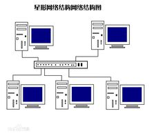
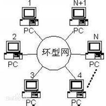
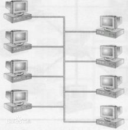
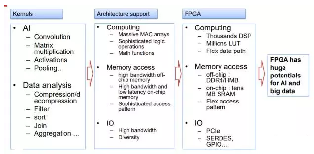

# Storage(Ceph)
> Ceph: A Scalable, High-Performance Distributed File System

## Features 
### 核心设计思想：
- Ceph通过用一个伪随机数据分布函数(CRUSH)替代分布表来最大化的分离数据与元数据管理，
- Ceph利用高度自适应分布式元数据集群,显著提高元数据访问的可扩展性,通过它也提高整个系统的可扩展性。
### 系统设计概览
- 三个主要组件：
  - 客户端：暴露near-POSIX的文件系统接口给主机或进程
  - OSD集群：存储所有数据和元数据
  - 元数据服务器集群：管理名空间(文件名和目录),协调安全与一致性

  
- 三个基本设计：
  - 分离数据和元数据
    - Ceph中完全消除分配列表的设计
    - 文件数据条带化到可计算的命名对象
    - 通过一个**数据分布函数CRUSH**将这些对象分配给存储设备
      - Ceph首先通过简单哈希算法将对象映射到放置组(PGs)，然后通过CRUSH算法将放置组分配到所有OSD。
      - 这个算法是一个伪随机数据分布算法， 能够有效地将每个PG映射到一个用来存储对象副本的有序OSD序列
      - 数据放置不依赖任何的块或对象列表元数据。为了定位每个对象， CRUSH只需要放置组和OSD的cluster map

  
  - 动态分布式元数据管理

    我们的设计通过使用一个双向的存储策略,和通过动态子树分区最大化的本地化和缓存效率进一步减少元数据相关的磁盘I / O。
    - 文件和目录元数据在Ceph中很小,几乎完全由目录入口(文件名)和inode(80字节)组成。
    - Ceph中不需要文件分布元数据，对象名称使用inode号， 并通过CRUSH算法分布到OSD
    - 采用基于**动态子树划分**的新型元数据集群结构
      - 通过使用计数器统计每个MDS中元数据的访问量。
      - 任何操作使得受影响inode及其上层节点直到根目录的计数都增加, 从而提供每个MDS一个权值，来描述最近的载荷分布。
      - 定期比较MDS权值, 通过迁移以保证元数据工作负载均匀分布。

    

    - 它能够适应性智能化地分配职责，可在十个甚至上百个MDS上管理文件系统目录结构。
    - 一个动态的层次分明的分区在每个MDS工作负载中被保留位置，可促进有效更新和预取
    - 元数据服务器的负载分布是基于当前的访问状态，使Ceph能在任何工作负载之下有效的利用当前的MDS资源，获得近似线性扩展性能。
  - 可靠的自动分布的对象存储 RADOS
    - Ceph承担着对存储数据的OSD集群进行数据迁移，备份，故障检测，故障修复的责任
    - OSD可给客户端和元数据服务器提供独立的逻辑对象存储EBOFS，使得Ceph能更加有效的利用计算资源处理能力(CPU和内存)，使每个OSD实现可靠、高可用性的线性扩展性能的对象存储
      - EBOFS设计是一个健壮，灵活并且完全集成B-tree服务，它被用于定位磁盘上对象， 管理块分布和收集索引(PG放置组), 通过开始位置与长度对管理块分配，替代了块列表方式， 使得元数据紧凑

    
   
## Pros & Cons
### Pros
- 本质上，Ceph的这些优势均来源于其先进的核心设计思想，有人将其概括为八个字——“无需查表，算算就好”。基于这种设计思想，Ceph充分发挥存储设备自身的计算能力，同时消除了对系统单一中心节点的依赖，从而实现了真正的无中心结构。基于这一设计思想和结构，Ceph一方面实现了高度的可靠性和可扩展性，另一方面保证了客户端访问的相对低延迟和高聚合带宽。
- 在这个核心设计思想的指导下，Ceph 有许多优秀特性，包括统一存储能力、可扩展性、可靠性、性能、自动化的维护等等。
### Cons
1. 代码质量
   - Ceph主要使用C/C++语言编写，同时外围的很多脚本和工具用了Python。相比于更加“现代”的语言，要想写出具备同样可读性、结构良好、调理清晰代码，C++要困难很多。但是，由于存储作为底层系统，对效率的追求是无止境的，因此不太可能舍弃对于内存等底层系统资源的控制，而使用Java/Python这类的语言。
2. 性能
   - 数据双倍写入
   -  IO路经过长
   -  对高性能硬件的支持有待改进。
3. 业务连续性
   - 当集群非常非常大时，Write-All-Read-One对于硬件可靠性的要求几乎是无法满足的。
## Measurement
### 数据性能
1. OSD的吞吐
  - 每个OSD在不同写入块大小和副本数下的吞吐， 工作负载由20个节点上的400个客户端应用组成，性能最后被磁盘读写带宽限制(58MB/s)所限制, 副本数为2或3时， 磁盘I/O会增大到二到三倍，当osd数固定，副本的增加会降低客户端的数据吞吐
  
  -  使用EBOFS和使用其他常用文件系统（ext3，ReiserFS，XFS）的性能对比。尽管小的读写性能会有影响，EBOFS还是能最大使用现有的磁盘带宽， 大于32KB时， 读显著的胜过其他文件系统

  

2. 写延迟

   
   
3. 数据分布和可扩展性 
   - Ceph的数据性能跟随OSD数量几乎线性变化。

### 元数据性能
1. 元数据更新延迟
2. 元数据读延迟

   
3. 元数据扩展 

## Comment
- Ceph 是一个开源系统，免费，初始成本低，但是并不是一个产品，后期运维成本高。
他的设计理念先进，运用了CRUSH算法和元数据动态子树分区；使用统一存储架构(Block/File/Object)，存储特性丰富。但是这也导致Ceph系统复杂系高，部署、优化难度较大，后期成本高。

-----

# Network
## 一、不同分类标准
#### 1、地理位置
(1)局域网(LAN)：一般限定在较小的区域内，小于10km的范围，通常采用有效的方式连接起来。

(2)城域网(MAN)：规模局限在一座城市的范围内，10~100km的区域。

(3)广域网(WAN)：网络跨越国界、洲界，甚至全球范围。

(4)个人网：个人局域网就是在个人工作地方把属于个人使用的电子设备（如编写电脑等）用无线技术连接起来的网络，因此也常称为无线个人局域网WPAN，其范围大约在10m左右。

#### 2、传输介质
(1)有线网：采用同轴电缆和双绞线来连接的计算机额网络。

(2)光纤网：光纤网也是有线网的一种，但光纤网采用光导纤维作为传输介质。

(3)无线网：用电磁波作为载体来传输数据。

#### 3.拓扑结构
(1)星型网络：各站点通过点到点的链路与中心站相连。

(2)环型网络：各站点通过通信介质连成一个封闭的环型。

(3)总线型网络：网络中所有的站点共享一条数据通道。

#### 4、通信分类
1、点对点：数据以点对点的方式在计算机或通信设备中传输。星型网、环型网采用这种传输方式

2、广播式：数据在共用介质中传输。无线网和总线型网络属于这种类型。

#### 5、使用目的
(1)共享资源：使用者可共享网络中的各种资源，如文件、扫描仪、绘图仪、打印机以及各种服务。Internet网是典型的共享资源网。

(2)数据处理网：用于处理数据的网络，例如科学计算网络、企业经营管理用网络。

(3)数据传输网：用来收集、交换、传输数据的网络，例如情报检索网络。

#### 6、服务分类
(1)客户机/服务器网络：服务器是指专门提供服务的高性能计算机或专用设备，客户机是用户计算机。这是客户机向服务器发出请求并获得服务的一种网络形式，多台客户机可以共享服务器提供的各种资源。

(2)对等网：对等网不要求文件服务器，每台客户机都可以与其他每台客户机对话，共享彼此的信息资源和硬件资源，组网的计算机一般类型相同。

#### 7、其他分类

按信息传输模式的特点来分类的atm网：网内数据采用异步传输模式，数据以53字节单元进行传输，提供高达1.2gbps的传输率，有预测网络延时的能力。可以传输语音、视频等实时信息，是最有发展前途的网络类型之一。

-----------

## 二、优缺点

#### 1、有线网
(1)优点：同轴电缆网比较经济，安装较为便利；双绞线网价格便宜，安装方便。

(2)缺点：同轴电网的方式传输率和抗干扰能力一般，传输距离较短；双绞线网的方式易受干扰，传输率较低，传输距离比同轴电缆要短。

#### 2、光纤网
(1)优点：传输距离长，传输率高，可高达千兆bps，抗干扰性强，不会受到电子监听设备的监听，是高安全性网络的理想选择。

(2)缺点：价格较高，而且需要高水平的安装技术。

#### 3、无线网

(1)优点：联网方式灵活方便，是一种很有前途的连网方式。

(2)缺点：联网费用较高

#### 4、星型网络

(1)优点：容易在网络中增加新的站点，数据的安全性和优先级容易控制，易实现网络监控。

(2)缺点：中心节点的故障会引起整个网络瘫痪。

#### 5、环型网络

(1)优点：容易安装和监控

(2)缺点：结构中容量有限，网络建成后，难以增加新的站点。

#### 6、总线型网络

(1)优点：网络安装简单方便，需要铺设的电缆最短，成本低，某个站点的故障一般不会影响整个网络。

(2)缺点：介质的故障会导致网络瘫痪，总线网安全性低，监控比较困难，增加新站点也不如星型网容易。

#### 7、客户机/服务器网络

(1)优点：这是最常用、最重要的一种网络类型。不仅适合于同类计算机联网，也适合于不同类型的计算机联网，如pc机、mac机的混合联网。这种方式网络安全性容易得到保证，计算机的权限、优先级易于控制，监控容易实现，网络管理能够规范化。

(2)缺点：网络性能在很大程度上取决于服务器的性能和客户机的数量。针对这类网络有很多优化性能的服务器称为专用服务器。银行、证券公司都采用这种类型的网络。

#### 8、对等网

(1)优点：这种网络方式灵活方便。

(2)缺点：较难实现集中管理与监控，安全性也低，较适合于部门内部协同工作的小型网络。

-----

## 三、个人观点
根据上文可知，网络根据不同的标准分成了不同的种类，这些标准从不同的方面剖析了当前网络的优缺点。所以，在选择网络时候，我们可以通过将上面的标准结合起来，再统一规划设计我们需要的网络结构和类型，以此来实现性能最优化和费用最小化。

----
# xPU
***
## Features
随着AI概念火爆全球，做AI芯片的公司也层出不穷。为了让市场和观众能记住自家的产品，各家在芯片命名方面都下了点功夫，既要独特，又要和公司产品契合，还要朗朗上口，也要容易让人记住。比较有意思的是，很多家都采用了“xPU”的命名方式。百度XPU芯片架构突出多样性，着重于计算密集型、基于规则的任务，同时确保效率、性能和灵活性的最大化。XPU的目标是在性能和效率之间实现平衡，并处理多样化的计算任务。FPGA加速器本身很擅长处理某些计算任务，但随着许多小内核交织在一起，多样性程度将会上升。

## Pros&Cons
### Pros
* 基于FPGA，FPGA是高效的，可以专注于特定计算任务。
* 关注计算密集型、基于规则的多样化计算任务，可以通过提高效率和性能，带来类似CPU的灵活性。
* FPGA中XPU的DSP单元提供了并行处理能力，片外DDR4和HBM接口优化了数据传输，而片上SRAM则提供了必要的存储特性。
* 对于没有数据同步的计算任务，XPU的可扩展性与核心数量呈线性关系。

### Cons
* 欠缺的仍是可编程能力，而这也是涉及FPGA时普遍存在的问题。到目前为止，XPU尚未提供编译器。
* 这款处理器在FPGA上实现，通过订制的逻辑电路提供指令。这些小核心类似于CPU，开发者只能使用汇编语言，而所有的执行都由主机来控制。
* 对于数据同步的计算任务，XPU的可扩展性还需进一步优化。

## Key indicators
### Training
* 高计算性能
* 高精度
* 对海量数据处理能力
* 一定的通用性
* 集中在云端
### Inference
* 用户体验
* 逐渐转移到终端

## Comment
AI的许多数据处理涉及矩阵乘法和加法。大量并行工作的GPU提供了一种廉价的方法，但缺点是更高的功率。具有内置DSP模块和本地存储器的FPGA更节能，但它们通常更昂贵。AI芯片该使用什么方法原理去实现，目前仍然众说纷纭，这是新技术的特点，探索阶段百花齐放，这也与深度学习等算法模型的研发并未成熟有关，即AI的基础理论方面仍然存在很大空白。这是指导芯片如何设计的基本前提。因此，目前集中在如何更好的适应已有的数据流式处理模式进行的芯片优化设计。

----
# Memory:DDR SDRAM & OPTANE
## DDR SDRAM简介
DDR SDRAM是一种用于计算机的双数据速率同步动态随机存取存储器类的存储器集成电路。
与单数据速率(SDR)SDRAM相比，DDR SDRAM接口通过更严格地控制电子数据和时钟信号的定时使得更高的传输速率成为可能。实现通常必须使用诸如锁相环和自校准之类的方案来达到所需的定时精度。接口使用双传输（在时钟信号的上升沿和下降沿上传输数据）来双倍数据总线带宽，而没有相应的数据总线带宽。时钟频率的增加。降低时钟频率的一个优点是它降低了连接存储器和控制器的电路板上的信号完整性要求。“双倍数据速率”是指具有特定时钟频率的DDR SDRAM由于这种双传输，在相同时钟频率下运行的SDR SDRAM的带宽达到几乎两倍。
如今，DDR内存已经发展到DDR4内存，DDR4 的性能更高、DIMM 容量更大、数据完整性更强且能耗更低。
-----
## DDR SDRAM特点
DDR4 每引脚速度超过 2Gbps 且功耗低于 DDR3L（DDR3 低电压），能够在提升性能和带宽 50% 的同时降低总体计算环境的能耗。这代表着对以前内存技术的重大改进，并且能源节省高达 40%。

除性能优化、更加环保、低成本计算外，DDR4 还提供用于提高数据可靠性的循环冗余校验 (CRC)，并可对链路上传输的“命令和地址”进行完整性验证的芯片奇偶检测。此外，它还具有更强的信号完整性及其他强大的 RAS 功能。
  
DDR4比其前身DDR3的主要优点包括更高的模块密度和更低的电压要求，以及更高的数据速率传输速度。DDR4标准允许DIMMs的容量高达64 GIB，而DDR3每DIMM最大16 GIB。

与前几代DDR存储器不同，预取没有增加到高于DDR3中使用的8n，基本突发大小是8个字，并且通过每秒发送更多的读/写命令来实现更高的带宽。为了实现这一点，该标准将DRAM位宽分成两个或四个可选择的位宽组，其中向不同位宽组的转换可以更快地完成。

由于功耗随着速度而增加，所以降低的电压以允许更高的速度运行，而不需要不合理的功率和冷却要求。

DDR4的工作电压在1.2V至1.4V之间，频率在800至2133MHz(DDR4-1600到DDR4-4266)之间，而频率在400至1067MHz之间，电压要求为1.5V或1.65V。由于DDR的性质，速度通常被宣传为这些数字的两倍(DDR3-1600和DDR4-2400是常见的，DDR3-3200和DDR4-4800以高成本提供)。尽管低压标准尚未最终确定(截至2014年8月)，但预计低压DDR4将以1.05V的电压运行，而DDR3的低压标准(DDR3L)需要1.35V才能运行。

-----

## Pros & Cons
- 优点
  - 速度快
  - 高频率，高带宽，高传输速率；
  - 电压更低。
  

- 缺点
  - 向下不兼容
  - 价格高
  - 对硬件（主板）接口有要求

## Optane简介
Optane是英特尔对新一代超高速存储模块的商标术语。这个名字特别指的是存储器本身，不是单独的格式，但是目前它主要以专门的M.2卡销售，只与支持使用的主板兼容，主板可以使用英特尔7代核心处理器（7XXX系列的i3、i5和i7芯片）。Optane存储器使用3D NAND制造技术和各种专有技术来实现超低延迟——高达10微秒。

-----
## Optane特点
Intel Optane技术结合了目前英特尔在存储研究上最为先进硬件介质和软件方案，其中硬件介质3D XPoint是整个Optane技术的核心。该介质目前既可以作为硬盘缓存为原来的机械硬盘或者固态硬盘提速，也可以直接作为非易失性存储介质保存数据。按官方数据，3D XPoint的读写速度和寿命均为NAND闪存的1000倍，在延迟是NAND闪存的千分之一，内存（DRAM）的10倍；存储密度则是内存的10倍。

它所采用的3D交叉矩阵结构摒弃了之前存储结构中的电容、晶体管设计，只保留内存单元（存数据的地方）、选择器和读写总线。原有的“闲杂人等”（电容、晶体管）被统统踢走，腾出来的空间塞进了更多的内存单元，存储容量因而得到大幅度的提高。

英特尔的工程师们还不满足，还想要在介质中加入更多的内存单元。可是芯片面积是有限制的，一味地横向增加芯片面积没有太大意义。于是他们将内存单元一层层地垒起来（也就是立体堆叠技术）。就像堆积木一样，基底的面积不变，层数不断增加，存储容量得到进一步提高。

在3D XPoint中，内存单元和选择器被存储总线交叉夹叠，每一层的总线又会被导线连接。这个又该怎么理解呢？按原来的方式，内存单元之间访问就像两个住在楼梯房的好朋友，每次去其中一家串门都需要走过道爬楼梯。而3D XPoint则是相当于给他们设置一个直达电梯，每次串门“叮”的一声就到了。这样一来，数据访问效率就高多了。

另外，3D XPoint通过改变电阻水平实现0和1的区分，数据以bit的形式存储在内存单元中，一个内存单元可存储1bit数据。而NAND的基本单元是page，NAND的page进行一次编程才能存储1bit数据，而且擦除操作还要在更高的block层进行。没有了NAND上的繁文缛节，数据访问速度自然更快更高效。

还有一点就是，3D XPoint上的电阻材质非常特殊，在电压作用该材质形态会发生巨大的变化，从而实现阻值的改变。在这个过程中，电阻材质形态的改变带来的损耗非常小，就像雾和雪一样，两者形态的转变最多只是热量的流失，而水的本质不变。相比于NAND上多次读写后就会出现的绝缘层损耗，3D XPoint的损耗基本可以忽略。所以我们可以看到，3D XPoint寿命是NAND的1000倍。

在性能方面，16GB版本Optane内存持续读取最高为900MB/s，持续写入最高为145MB/s；4K 随机读取为190000 IOPS，4K随机写入是35000 IOPS。32GB版本持续读取速度为1200MB/s，持续写入最高为280MB/s；4K 随机读取为300000 IOPS，4K随机写入是70000 IOPS。从官方给的数据看，Optane内存不管是持续性能还是随机性能，读取性能均远好于写入性能。
-----

## Pros & Cons
- 优点
  - 速度较快
  - 提升了机械硬盘的性能；
  - 与CPU的协同表现更好。
  

- 缺点
  - 相对于DDR内存价格偏高
  - 对CPU规格和接口有要求
  - 对硬件（主板）接口有要求
  - 由于是新技术，其可靠性难以判断
## Comments
DDR SDRAM技术已经诞生二十年了，新的DDR5内存也将在不久之后发布。届时会有更快的速率，更低的功耗和更高的稳定性。而Optane内存的思路则是提升机械硬盘的速率来与SSD对抗。虽然不是针对DDR内存，但是变相为计算机的存储系统带来一场革命。更大的容量，相对于SSD更高的性价比，以及性能上的出色表现，使得傲腾内存为传统的Memory+Storage模式带来挑战。

----

