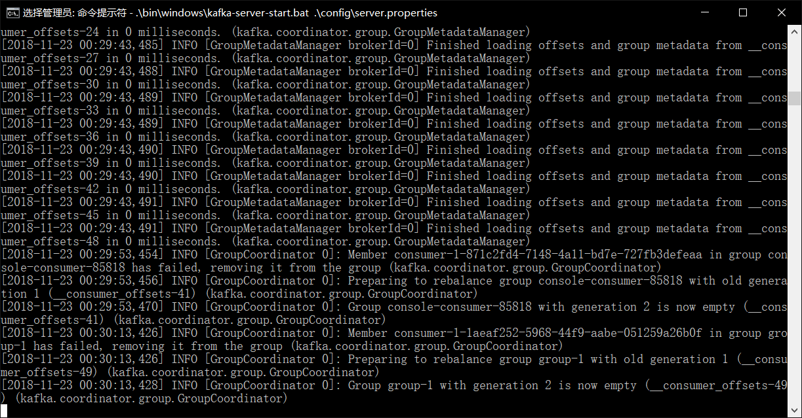

# Kafka的安装配置
***
## 准备工作
* 下载zookeeper：http://zookeeper.apache.org/releases.html#download  
这里我选择了3.4.13版本  
完成后解压到E://Kafka目录下
* 下载kafka：http://kafka.apache.org/downloads  
这里我选择了2.11-2.0.1版本  
完成后解压到E://Kafka目录下
## 修改配置文件
* zookeeper配置文件修改  
使用notepad++打开zookeeper-3.4.13/conf文件夹中的zoo.cfg修改 
> dataDir=E:\\Kafka\zookeeper-3.4.13\\tmp
* kafka配置文件修改  
使用notepad++打开kafka_2.11-2.0.1\config文件夹中的server.properties修改
> log.dirs=E:\\Kafka\kafka_2.11-2.0.1\logs  
* kafka配置文件修改  
使用notepad++打开kafka_2.11-2.0.1\config文件夹中的zookeeper.properties修改
> dataDir=E:\\Kafka\kafka_2.11-2.0.1\zookeeper
## 启动Kafka服务
* 启动zookeeper  
在cmd下进入zookeeper的解压目录下，输入zkServer，得到以下结果  

* 启动kafka
创建一个新的cmd，进入kafka解压目录下，输入.\bin\windows\kafka-server-start.bat .\config\server.properties，得到以下结果  

## 测试
* 创建topic
创建一个新的cmd，进入kafka解压目录下，输入.\bin\windows\kafka-topics.bat --create --zookeeper localhost:2181 --replication-factor 1 --partitions 1 --topic kafka-test

* 启动producer
在当前cmd中，输入.\bin\windows\kafka-console-producer.bat --broker-list localhost:9092 --topic kafka-test
* 启动consumer
创建一个新的cmd，进入kafka解压目录下，输入.\bin\windows\kafka-console-consumer.bat --bootstrap-server localhost:9092 --topic kafka-test --from-beginning  
consumer中如果得到producer中输入的消息，表明测试成功。
