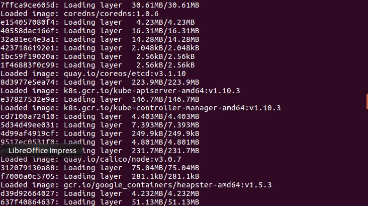
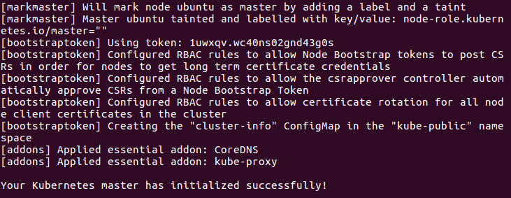
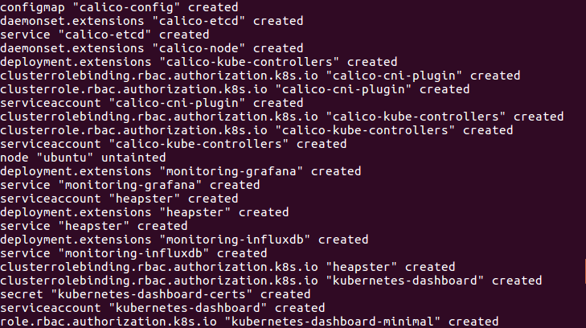
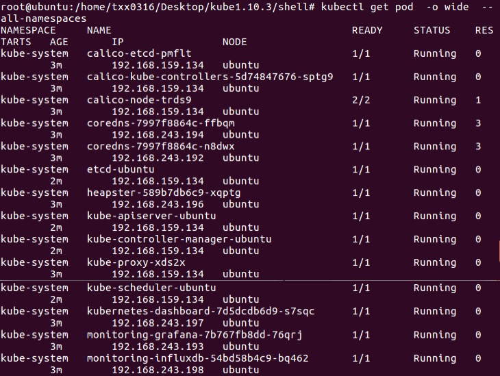
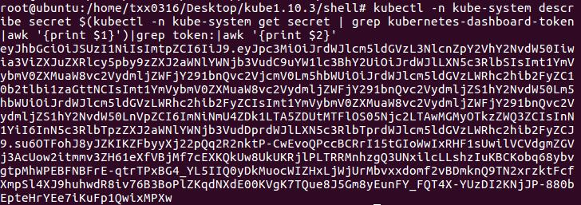
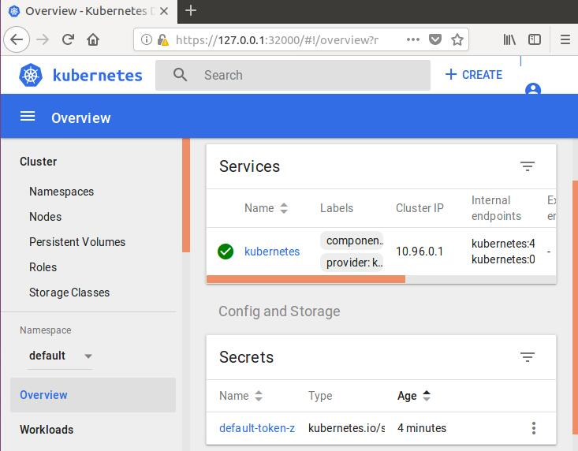

# Kubernetes配置
***
## 准备工作
### 操作系统
* Ubuntu 16.04 LTS
### 环境配置
#### 安装Docker、Docker.io
    sudo apt-get install docker
    sudo apt-get install docker.io
#### 修改配置文件k8s.conf
    cat <<EOF >  /etc/sysctl.d/k8s.conf
    net.bridge.bridge-nf-call-ip6tables = 1
    net.bridge.bridge-nf-call-iptables = 1
    EOF
#### 关闭selinux、firewall和swap 
    systemctl stop firewalld && systemctl disable firewalld
    swapoff -a
    setenforce 0
### 安装Kubernetes
#### 加载images.tar
因为google不能使用的原因，这里我找到了一个国内的资源包images.tar.
    
    docker load -i ../images/images.tar
运行结果如下图  

#### 修改配置文件10-kubeadm.conf
    [Service]
    Environment="KUBELET_KUBECONFIG_ARGS=--bootstrap-kubeconfig=/etc/kubernetes/bootstrap-kubelet.conf --kubeconfig=/etc/kubernetes/kubelet.conf"
    Environment="KUBELET_SYSTEM_PODS_ARGS=--pod-manifest-path=/etc/kubernetes/manifests --allow-privileged=true"
    Environment="KUBELET_NETWORK_ARGS=--network-plugin=cni --cni-conf-dir=/etc/cni/net.d --cni-bin-dir=/opt/cni/bin"
    Environment="KUBELET_DNS_ARGS=--cluster-dns=10.96.0.10 --cluster-domain=cluster.local"
    Environment="KUBELET_AUTHZ_ARGS=--authorization-mode=Webhook --client-ca-file=/etc/kubernetes/pki/ca.crt"
    Environment="KUBELET_CADVISOR_ARGS=--cadvisor-port=0"
    Environment="KUBELET_CGROUP_ARGS=--cgroup-driver=${driver}"
    Environment="KUBELET_CERTIFICATE_ARGS=--rotate-certificates=true --cert-dir=/var/lib/kubelet/pki"
    ExecStart=
    ExecStart=/usr/bin/kubelet \$KUBELET_KUBECONFIG_ARGS \$KUBELET_SYSTEM_PODS_ARGS \$KUBELET_NETWORK_ARGS \$KUBELET_DNS_ARGS   \$KUBELET_AUTHZ_ARGS \$KUBELET_CADVISOR_ARGS \$KUBELET_CGROUP_ARGS \$KUBELET_CERTIFICATE_ARGS \$KUBELET_EXTRA_ARGS
    EOF
### 开启Kubernetes服务
#### 初始化master node
    kubeadm init --config ../conf/kubeadm.yaml
    mkdir ~/.kube
    cp /etc/kubernetes/admin.conf ~/.kube/config
    kubectl apply -f ../conf/net/calico.yaml
    kubectl taint nodes --all node-role.kubernetes.io/master-
得到结果  

#### 应用heapster和dashboard
    kubectl apply -f ../conf/heapster/
    kubectl apply -f ../conf/heapster/rbac
    kubectl apply -f ../conf/dashboard
得到结果  

#### 查看服务状态
    kubectl get pod -o wide --all-namespaces
得到结果

### Dashboard
#### 查看token值
    kubectl -n kube-system describe secret $(kubectl -n kube-system get secret | grep kubernetes-dashboard-token|awk '{print $1}')|grep token:|awk '{print $2}'
得到结果

#### 使用token登录
打开浏览器输入地址https://127.0.0.1:32000/ ，选择token登录，将刚刚运行得到的token值复制进去.  
最终进入Dashboard  

### DNS

