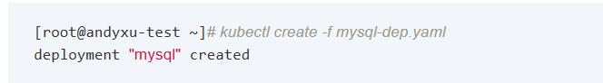
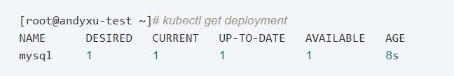
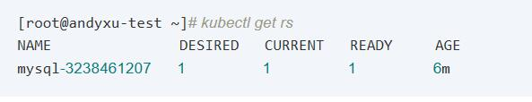
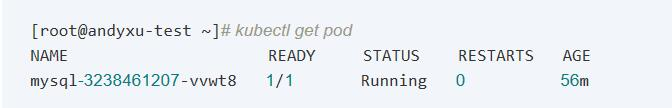
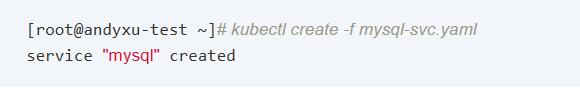
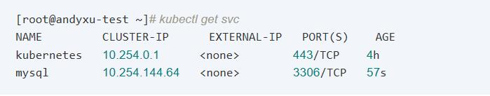

## 把一个Java web应用部署到Kubernetes(K8s)

### 准备工作：

1、一个web应用，带front-end，back-end和database，而且数据库是MySQL

2、搭建好的kubernetes环境

3、把web项目打包成一个镜像，并push到DaoCloud，保证可以成功pull the image

4、修改docker的源为国内的地址

#curl -sSL https://get.daocloud.io/daotools/set_mirror.sh | sh -s http://f1361db2.m.daocloud.io

执行上面的命令，然后如果发现dockers运行有问题，报如下的错误：Job for docker.service failed because the control process exited with error code. See "systemctl status docker.service" and "journalctl -xe" for details.

解决办法：在这个文件中/etc/docker/daemon.json {"registry-mirrors": ["http://****.m.daocloud.io"]，} 最后一个多了一个逗号，把逗号去掉以后，程序应该可以正常启动。

### 部署过程

1、在kubernetes中创建并配置mysql容器

需要的文件：mysql-dep.yaml、mysql-svc.yaml
 
mysql-dep.yaml文件用来创建一个deployment和pod

创建过程：

--运行mysql-dep.yaml

--查看创建好的deployment

注：都是1表示运行正常

--查看RS的运行情况

注：都是1表示运行正常

--查看pod的运行情况

注：READY的值是1/1，并且STATUS的值是Running，表示运行正常
由于Pod的创建需要花费一些时间，在还没有创建好容器时，STATUS的状态会是ContainerCreating，表示正在创建容器，这时只需要等待。Pod创建好后，STATUS的状态会是Running，这时可以通过docker ps命令查看容器运行的情况。

--查看容器的运行情况

mysql-svc.yaml用来创建一个service，从而使其他的容器的可以访问这个pod

创建过程：

--执行mysql-svc.yaml

--查看创建的service

kubernetes会给Service分配一个Cluster IP，这是个虚拟IP地址，此后集群中的其他新创建的Pod就可以通过此Cluster IP+端口号的方式来连接和访问mysql服务了。

二、创建并配置tomcat容器

需要文件:myweb-dep.yaml、myweb-svc.yaml

创建过程同mysql类似，注意在myweb-dep.yaml中的mysql的IP地址要换成建好mysql service 的cluster IP

三、通过浏览器访问

在地址栏中输入myweb所在的nodeIP+端口号就可以访问

